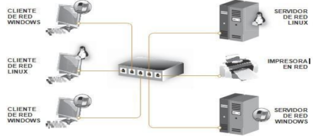
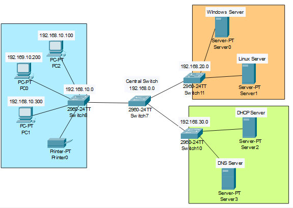

# Secure Network Design

## Objective

Analyze an existing network infrastructure, identify weaknesses and propose improvements focused on security, scalability and resilience.

## Initial Scenario

The original network consisted of:

* A central switch
* Windows and Linux servers
* Multiple client devices
* A network printer

The infrastructure presented several limitations, including a single point of failure and limited segmentation.

## Identified Risks

* Single point of failure at the central switch
* Lack of network segmentation
* Limited access control mechanisms
* Absence of dedicated infrastructure services
* Insufficient contingency planning

## Proposed Improvements

### Network Segmentation

Additional switches were introduced to separate:

* Client devices
* Servers
* Infrastructure services

### VLAN Implementation

VLANs were proposed to isolate traffic between departments and reduce lateral movement opportunities.

### Access Control

ACLs were recommended to restrict communications according to business requirements.

### Infrastructure Services

Dedicated DHCP and DNS services were introduced to improve management and scalability.

### Risk Assessment

A formal risk analysis was proposed to identify:

* Service dependencies
* Misconfigurations
* Monitoring gaps
* Business continuity risks

### Business Continuity

The design includes recommendations such as:

* Configuration backups
* Patch management
* DHCP failover
* Load balancing
* Hardware redundancy

## Key Takeaways

Network security is not limited to deploying security tools. Proper segmentation, access control, redundancy and contingency planning are fundamental components of a secure infrastructure.

## Disclaimer

This project was developed as part of an educational cybersecurity training program.
